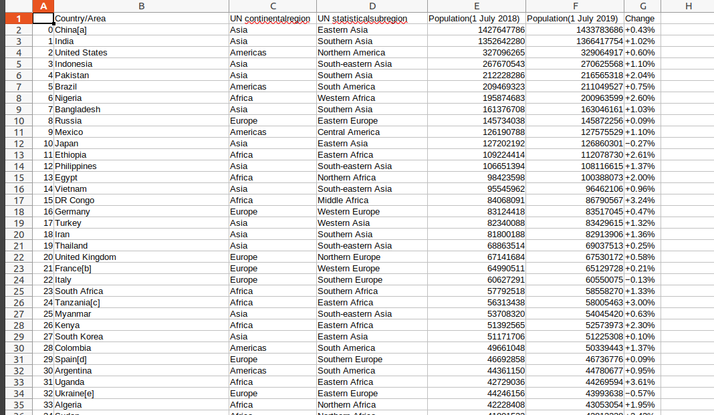

# Web-scraping

## Web application that I used
```
Jupyter Notebook
```

## Used Python packages
```
BeautifulSoup
```

## Used Python library
```
1. requests
2. pandas
```

## Data scraped from:
```
[wikipedia](https://en.wikipedia.org/wiki/List_of_countries_by_population_(United_Nations))
```
## Images

